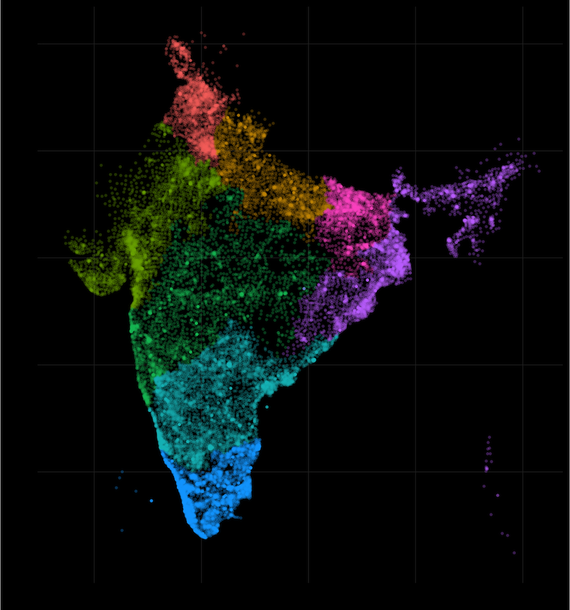

The pincodes of India.

[](https://github.com/amitkaps/multidim/blob/master/4-Pincode.Rmd)

Downloaded using the following command:

```
curl -O https://raw.githubusercontent.com/amitkaps/multidim/master/data/pincode.csv
```

Originally published as part of the excellent presentation ["Visualising Multi Dimensional Data" by Amit Kapoor](https://github.com/amitkaps/multidim).
