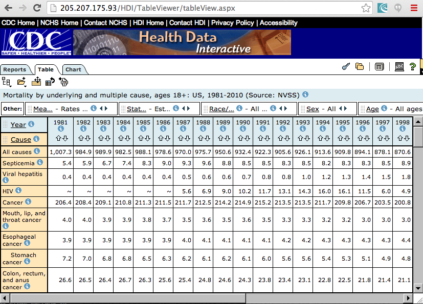

This directory contains data about causes of death by year from 1981 to 2010 from the US Centers for Disease Control. The file `mortality_underyling_cause_by_years_original.csv` contains the original data downloaded from the [Health Data Interactive Site](http://205.207.175.93/HDI/TableViewer/tableView.aspx). The original downloaded file is not valid CSV, and was modified to reflect the table shown in the Web interface by Curran Kelleher on 2/12/2014. The file `mortality_underyling_cause_by_years.csv` contains the cleaned version.

</img>
Screenshot of the data download page, using the [Beyond 20/20 Web Data Server](http://www.beyond2020.com/index.php/data-solutions/products/web-data-server).
