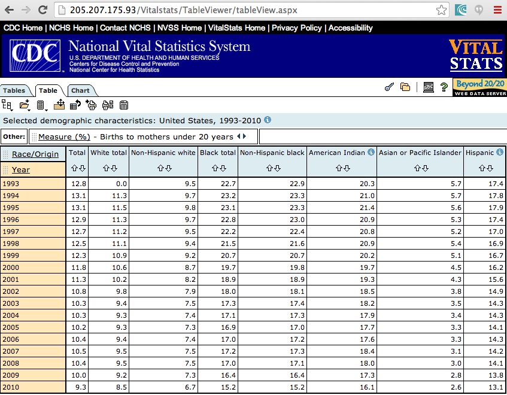

The file `mothersUnder20_original.csv` contains the CSV data directly downloaded from the US Centers for Disease Control National Vital Statistics System](http://205.207.175.93/Vitalstats/TableViewer/tableView.aspx) on 2/12/2014 by Curran Kelleher. The original file is not valid CSV, and was hand-edited to reflect the table shown in the data download interface. The file `mothersUnder20.csv` contains the cleaned version of the table.

</img>
Screenshot of the data download page.

