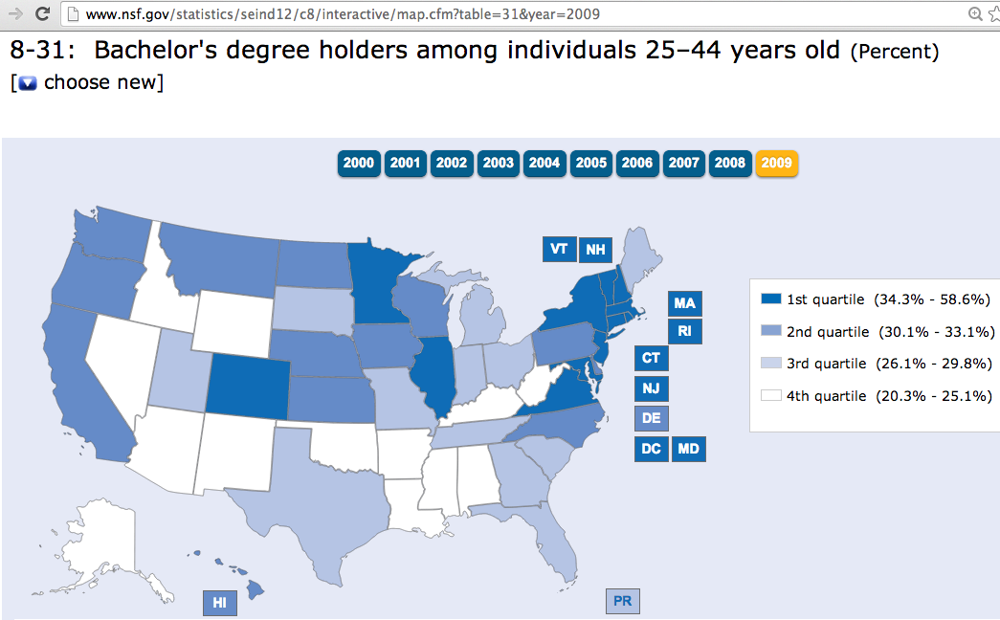

This directory contains data about the percentage of the population who have bachelors degrees by year from 2000 to 2009 from the National Science Foundation. The file `bachelorsDegrees_original.xls` contains the original data downloaded from the [NSF SCIENCE and ENGINEERING INDICATORS 2012 State Data Tool](http://www.nsf.gov/statistics/seind12/c8/interactive/map.cfm?table=31&year=2009).

</img>
Screenshot of the data download page with interactive map.
