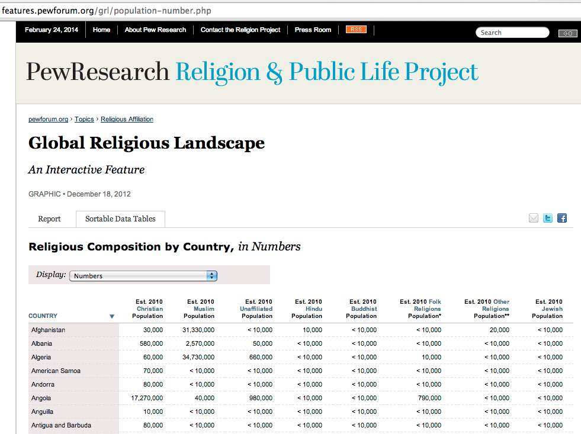

This directory contains data extracted from the Pew Research Center [Global Religious Landscape data set](http://features.pewforum.org/grl/population-number.php).

 * `rawData.txt` contains the data table content copy-and-pasted from the [data table page](http://features.pewforum.org/grl/population-number.php).
 * `religionByCountry.csv` contains the data table content after being cleaned by `rawDataToCSV.js`.
 * `religionByCountry.js` contains the data table content as an AMD module, created by `csvToAMD.js`.

</img>
A screenshot of the [data table page](http://features.pewforum.org/grl/population-number.php).

See also this [Map visualization of the religion data](http://www.pewforum.org/2012/12/18/global-religious-landscape-buddhist/), which is a scatter plot layered on top of a geographic map with size representing number of adherents.

