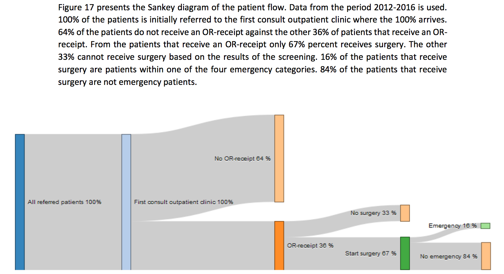

## files

`graph.json`

## data source 

_Enabling measuring of the patient flow in an orthopaedic clinic_  
[abstract](http://essay.utwente.nl/70229/)  
[pdf](http://essay.utwente.nl/70229/1/Bos%26Hasper_BA_BMS.pdf)  

## visualizations

