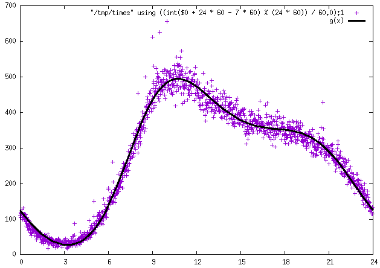

This dataset contains the number of tweets for each minute of the day (in GMT) aggregated across a subset of Twitter users (those 521 people that [Eric Fischer](https://twitter.com/enf) follows) over 327 days (January 8, 2015 through November 30, 2015). Original data collection and transformation work was done by [Eric Fischer](https://twitter.com/enf). The original data is in [gistfile1.txt](gistfile1.txt), copied from this [Gist](https://gist.github.com/ericfischer/db268f44e8cf58f5799f). This file was manually edited to create the CSV file [tweets_by_minute.csv](tweets_by_minute.csv).

The above image is the original visualization of this dataset done by Eric Fischer, posted on Twitter Nov. 30, 2015. It shows there is a spike in activity around 10AM GMT.

This dataset was added to this collection with permission.
