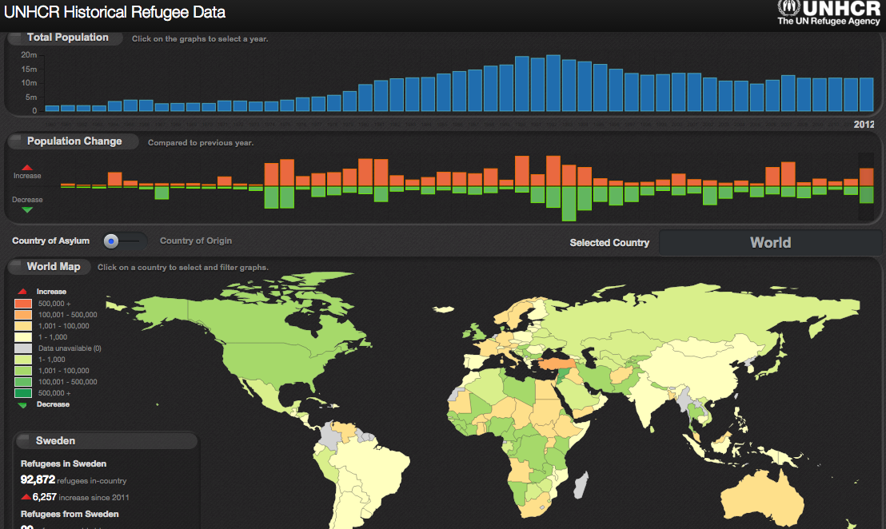

This is the data presented in [http://data.unhcr.org/dataviz/](http://data.unhcr.org/dataviz/).



The data file was extracted from the site using the following command:

```
curl -O http://data.unhcr.org/dataviz/data.js
```
