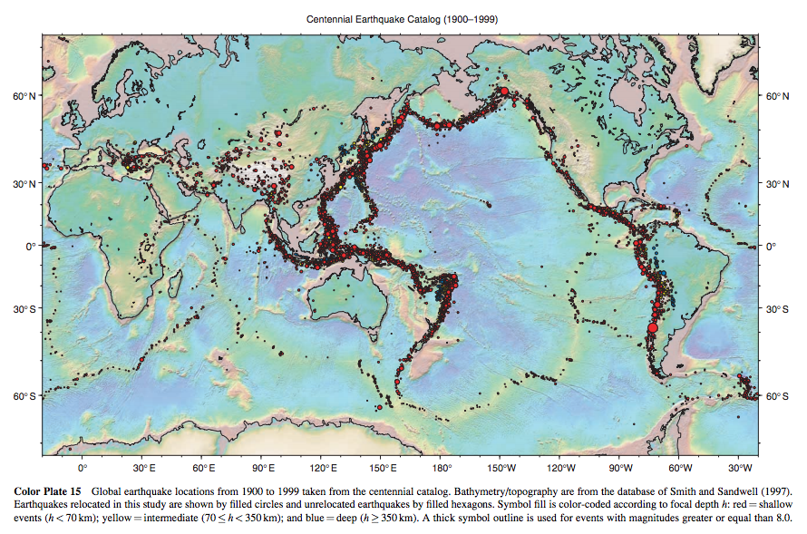

Earthquake data from [USGS Centennial Earthquake Catalog](http://earthquake.usgs.gov/data/centennial/), a "global catalog of locations and magnitudes of instrumentally recorded earthquakes from 1900 to 2008".

Here's a [visualization of the data](http://earthquake.usgs.gov/data/centennial/centennial_plate15.pdf)

